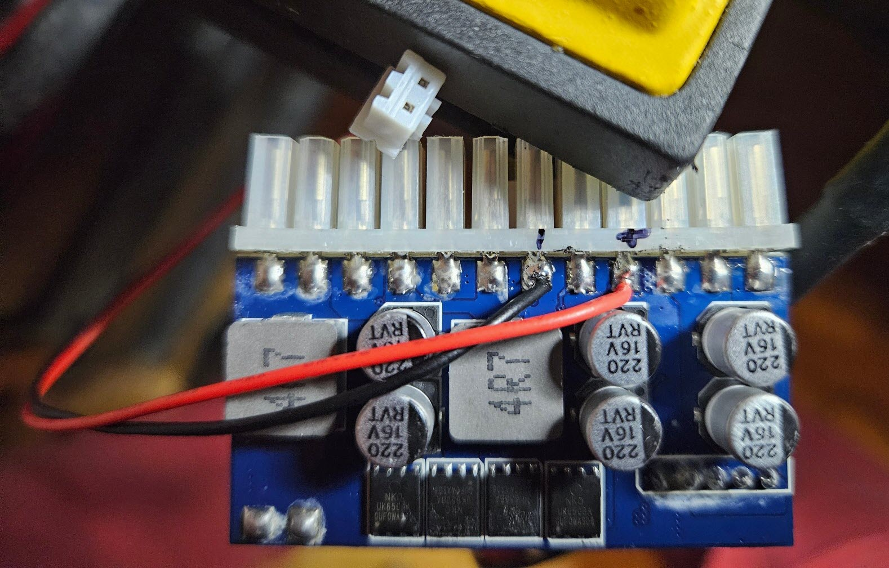
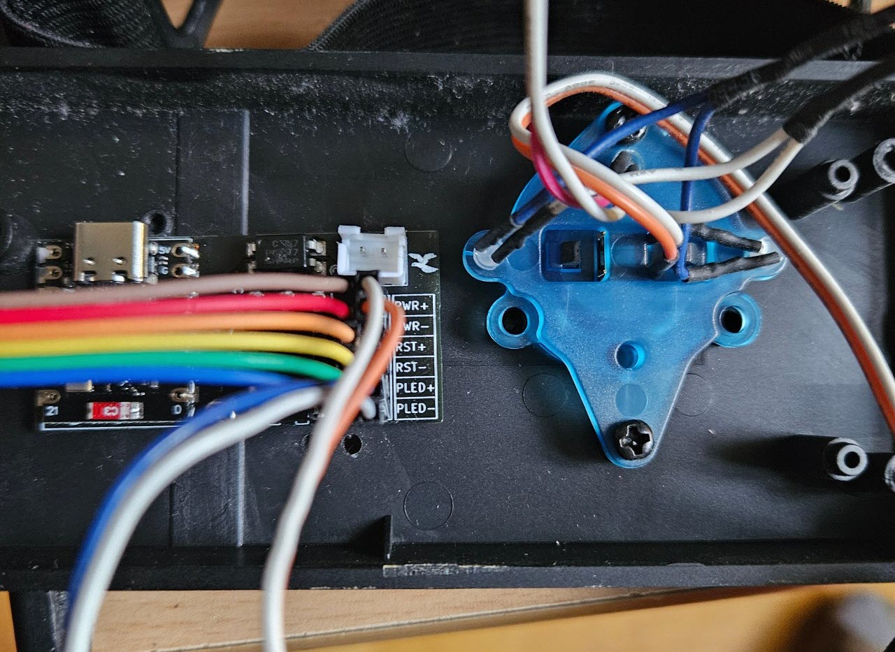

# PC-Power-Control

Remote startup, shutdown, reset and LED status monitoring for your PC with Home Assistant/ESPHome, powered by ESP32-C3 SuperMini board.

Control the power state of your PC and monitor LED status through Home Assistant by connecting your power, reset, and power LED front panel connectors to the appropriate pin pairs on ESP32-C3. Easily turn on and off your PC remotely using Home Assistant, keep track of the LED status. It's powered by +5V directly from the ATX connector.

## Use Cases

- Turn on, off and reset your PC remotely using Home Assistant.
- Set up automation based on time, motion, or any trigger to power on your PC.
- Utilize +5V from the ATX connector for powering the ESP32-C3 SuperMini, eliminating the need for an external power source.
- Achieve reliable control over your PC's power state without relying on wake-on-LAN.
- Enhance security by avoiding addons with admin access to your Windows PC. Use Home Assistant with ESPHome for seamless integration.
- Add voice commands via Home Assistant to control your PC using Google Assistant.

# Project Documentation

todo

## Getting Started

Follow the steps below to set up PC-Power-Control with your ESP32-C3 SuperMini:

1. **Hardware Connections:** Connect your power, reset, and power LED front panel connectors to the specified pin pairs on ESP32-C3 SuperMini. Also, connect the ESP32-C3 SuperMini to the +5V from the ATX connector.
   
2. **Power Up:** Provide power to the ESP32-C3 SuperMini directly from the ATX connector.
3. **Integration with Home Assistant using ESPHome:**
    - Install ESPHome on your ESP32-C3 SuperMini.
    - Configure ESPHome YAML file with the necessary settings, including pin assignments and Home Assistant integration.
    - Flash the ESPHome firmware to your ESP32-C3 SuperMini.

**ESPHome Template:** ``
todo
``

## PCB Specification
- Dimension: 23.75mm x 48.45mm
- PCB Thickness: 1.6mm

## Bill of Material

| Pos | References | Description | Value | Size | Quantity | Order Links \* | Notes |
|-----|------------|-------------|-------|------|----------|-------------|-------|
| 01 | ESP32-C3 SuperMini | ESP32-C3 SuperMini |  | ESP32-C3 | 1 | [Aliexpress](https://www.aliexpress.com/item/1005006127487371.html) | |
| 02 | U1, U2, U3 | PC817C SOP |  | PC817C SOP | 3 | [Aliexpress](https://www.aliexpress.com/item/1005003176703694.html) | |
| 03 | R1, R2 | Resistor | 330R | 0805 | 2 | [Aliexpress](https://www.aliexpress.com/item/1005001794062302.html)  | 
| 04 | R3 | Resistor | 2K2 | 0805 | 1 | [Aliexpress](https://www.aliexpress.com/item/1005001794062302.html)  | 
| 05 | J1 | Connector | P2 | JST XH2.54 | 1 | [Aliexpress](https://www.aliexpress.com/item/32954418743.html)  | 
| 06 | J2 | Connector | 2x6 | 2.54mm | 1 | [Aliexpress](https://www.aliexpress.com/item/1005003296463136.html)  | 

\* *I have not tested all parts using this order links, no guarantee that every linked component works. Aliexpress links are affiliate links, so i will get a small commission when you order using this link. This will help me with further projects. Thanks.*

## LICENSE

All content in this repository is is licensed under a [Creative Commons Attribution-NonCommercial-ShareAlike 4.0 International license](https://creativecommons.org/licenses/by-nc-sa/4.0/).

